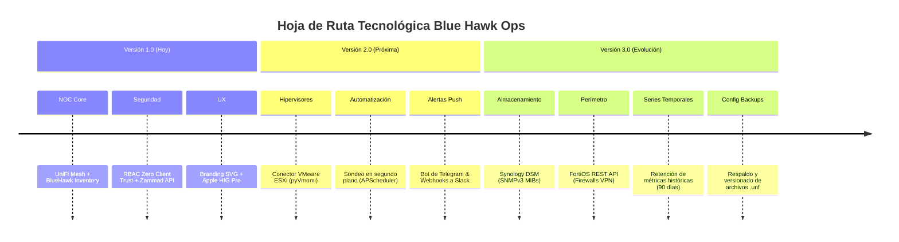

# BLUE HAWK OPS (BHOps) — RESUMEN EJECUTIVO & MANUAL DE SISTEMA
**Plataforma Unificada de Observabilidad de Infraestructura, Reconciliación de Activos y Telemetría NOC**  
*Blue Hawk Technologies • Documento Maestro Versión 1.0 (Producción)*

---

## 1. VISIÓN GENERAL Y PROPÓSITO DEL PRODUCTO

### 1.1 ¿Qué es Blue Hawk Ops (BHOps)?
**Blue Hawk Ops (BHOps)** es la consola centralizada de operaciones de red y soporte de infraestructura tecnológica de **Blue Hawk Technologies**. Su propósito fundamental es eliminar la brecha existente entre la **infraestructura de red activa** (lo que realmente está transmitiendo paquetes en las sedes) y el **inventario físico contable** (los activos registrados y catalogados por la empresa).

Tradicionalmente, los departamentos de TI sufren de tres problemas críticos:
1. **Puntos Ciegos y Desconexión**: Los controladores de red (UniFi, FortiGate, Meraki) ven dispositivos activos, pero no conocen su código de activo ni su responsable físico.
2. **Drift de Inventario no Supervisado**: Equipos que desaparecen de la red sin aviso o nuevos equipos instalados sin catalogar que pasan desapercibidos durante meses.
3. **Respuesta Lenta ante Incidentes**: Ante una caída de un switch o enlace de fibra, los técnicos pierden tiempo buscando a qué proveedor reportar, qué circuito está fallando o qué runbook aplicar.

**BHOps unifica estos mundos en una sola interfaz bajo estándares de ingeniería aeroespacial y de telecomunicaciones.**

---

## 2. ARQUITECTURA TÉCNICA DEL SISTEMA

BHOps está construido bajo una arquitectura moderna, desacoplada y de **Mínimo Privilegio (Zero Client Trust)**:

```
┌────────────────────────────────────────────────────────────────────────┐
│                          CLIENTE / NAVEGADOR                           │
│  Next.js 16 (Turbopack) • React 19 • Tailwind CSS v4 • Apple HIG Pro  │
│  Branding SVG Nativo (BHOps) • Framer Motion • Recharts Monocromático │
└───────────────────────────────────┬────────────────────────────────────┘
                                    │ HTTPS + Bearer JWT
┌───────────────────────────────────▼────────────────────────────────────┐
│                       CORE API BACKEND (FastAPI)                       │
│  Python 3.12 • SQLAlchemy 2.0 Async • Uvicorn • Pydantic Domain Schema │
│  RBAC Server-Side (Admin L3 / Técnico L2 / Operador L1)                │
└───────┬───────────────────────────┬────────────────────────────┬───────┘
        │                           │                            │
┌───────▼────────┐         ┌────────▼─────────┐         ┌────────▼───────┐
│ BASE DE DATOS  │         │ CONECTORES RED   │         │ SERVICIOS EXT. │
│ SQLite Async / │         │ UniFi Network    │         │ Zammad API     │
│ PostgreSQL     │         │ BH Inventory     │         │ Helpdesk       │
│ Audit Trail    │         │ VMware (pyvmomi) │         │ ISP Claro Mon. │
└────────────────┘         └──────────────────┘         └────────────────┘
```

### Principios Fundamentales de Seguridad:
1. **Zero Client Trust**: El rol del usuario jamás se envía en una cabecera editable por el cliente (se eliminó `X-User-Role`). El servidor valida el JWT firmado criptográficamente y consulta la base de datos para verificar permisos antes de permitir sincronizaciones o resoluciones de incidentes.
2. **Acceso de Solo Lectura (Strict Read-Only)**: BHOps monitorea y audita; no altera la configuración de origen en los controladores UniFi ni en los hipervisores. Las consolas de los fabricantes conservan la autoridad de configuración.
3. **Aislamiento Multi-Tenant**: Cada cliente y sede cuenta con su propio identificador (`org_id`, `site_id`), garantizando que los datos de telemetría y topología no se mezclen.

---

## 3. LO QUE EL SISTEMA TIENE HASTA AHORA (VERSIÓN 1.0 OPERATIVA)

El sistema en su versión actual está **100% operativo y listo para despliegue en servidor**. Incluye 5 módulos principales accesibles desde la barra lateral:

### Módulo 1: Panel General de Operaciones (Overview)
- **6 Tarjetas de Métricas Normalizadas (Enterprise NOC)**:
  - *Dispositivos en Red*: Conteo total de nodos detectados en la sede activa.
  - *Enlaces Activos*: Indicador semántico de salud operativa (100% Reachable con pulso verde).
  - *Puntos de Acceso*: Total de APs Wi-Fi 6 y Wi-Fi 7 Pro.
  - *Switch Trunks*: Total de switches de distribución y acceso PoE.
  - *Activos Físicos*: Total de equipos catalogados en BlueHawk Inventory.
  - *Reconciliación*: Indicador semántico de atención/drift (alerta ámbar cuando hay diferencias pendientes de firma).
- **3 Gráficos de Observabilidad Técnica**:
  - *Donut de Categorías*: Distribución de hardware en paleta corporativa Blue Hawk (`#1e40af`, `#2563eb`, `#38bdf8`, `#64748b`).
  - *Uptime de Enlace & Latencia*: Monitoreo continuo de SLA (99.98%) y RTT en milisegundos.
  - *Carga Wi-Fi & Nodos*: Clientes concurrentes conectados por cada Access Point y switch.
- **Tabla de Telemetría en Tiempo Real**:
  - Búsqueda instantánea por nombre, modelo, IP, MAC address o activo.
  - Filtros rápidos por categoría (`ALL`, `SWITCH`, `AP`, `GATEWAY`).
  - Indicador de estado por hardware (Online / Offline).
- **Cola Rápida de Discrepancias (Drift Queue)**:
  - Visualización inmediata de equipos con diferencias entre inventario y red.

### Módulo 2: Topología Física & Runbooks de Emergencia
- **Diagrama Jerárquico de Red**: Visualización en árbol que conecta el Gateway principal con los switches de distribución y los APs finales a través de sus puertos troncales (`uplink_port`).
- **Runbooks de Diagnóstico Integrados**:
  - `RB-01 (Caída WAN / Gateway)`: Procedimiento de verificación de puerto SFP+, ping a DNS, y datos de escalado directo con Claro Dominicana (Circuito CL-9812-BH, teléfono directo de averías 809-220-1111).
  - `RB-02 (Diagnóstico de Switch)`: Pasos para comprobar consumo PoE, errores CRC en trunks y detección de loops STP.
  - `RB-03 (Incidencia Wi-Fi / AP Degradado)`: Análisis de saturación RF, negociación 2.5G/Gigabit y canales DFS.
- **Copia de Parámetros**: Botón para copiar ficha técnica de cualquier nodo al portapapeles con un solo click.
- **Escalado Inmediato**: Botón para abrir un ticket en Zammad Helpdesk precargado con el runbook del nodo.

### Módulo 3: Reconciliación de Activos & Auditoría de Drift
- **Motor Determinista de Reconciliación**:
  - Cruza las direcciones MAC y números de serie de BlueHawk Inventory contra la red UniFi.
  - Clasifica las desviaciones en:
    - `missing_from_network`: El equipo existe en el inventario contable pero no responde en la red (posible robo, daño o desconexión).
    - `uncataloged_device`: El equipo está transmitiendo en la red pero no tiene código de activo (posible equipo no autorizado o no registrado).
- **Firma Técnica y Resolución**:
  - Permite a Técnicos (L2) y Administradores (L3) firmar digitalmente la justificación técnica, registrando quién resolvió el incidente y la fecha/hora exacta.

### Módulo 4: Ticketing Automático Bidireccional con Zammad
- **Integración Nativa con Zammad REST API**:
  - Ante una discrepancia o fallo en un switch/AP, genera un ticket con prioridad calculada (Urgente para caídas, Normal para drift).
  - Cuerpo del ticket formateado profesionalmente con todos los metadatos técnicos (IP, MAC, ubicación física en rack, fecha UTC y runbook sugerido).
  - Guarda el número de ticket (`#73009`) en la base de datos de BHOps para trazabilidad inmediata.

### Módulo 5: Monitor de Sondas & Conectores
- **Sonda de BlueHawk Inventory**: Verificación continua de conectividad contra `inventory.bluehawktech.com/api/v1`.
- **Sonda de Zammad Helpdesk**: Verificación continua del token HTTP contra `support.bluehawktech.com`.
- **Sonda de UniFi Network**: Estado de sincronización en tiempo real del controlador local o en nube.
- **Conectores de Infraestructura**: Tarjetas de telemetría pasiva para Proxmox VE / VMware ESXi y FortiOS (FortiGate).

### Módulo 6: Identidad Visual, Reportes & Cumplimiento
- **Branding Vectorial BHOps**: Logotipos SVG nítidos en modo oscuro y claro, favicon oficial SVG en la pestaña del navegador e insignia squircle en la barra lateral.
- **Barra Lateral Colapsable**: Transición fluida entre modo completo (256px) y colapsado (80px con badge `Ops` y dot de alertas).
- **Reportes Ejecutivos**: Métricas de cumplimiento de SLA diseñadas para presentación ante juntas directivas.
- **Modal de Gobernanza Legal**: Matriz completa de roles, políticas de privacidad y directivas de retención según estándares institucionales de Blue Hawk.
- **Manual Operativo Integrado**: Guía interactiva paso a paso accesible desde el footer de la aplicación.

---

## 4. ROLES DE USUARIO Y MATRIZ DE PERMISOS (RBAC)

BHOps implementa un modelo estricto de tres niveles de acceso:

| Rol | Nivel | Responsabilidades | Permisos en la Consola |
| :--- | :---: | :--- | :--- |
| **Operador** | **L1** | Monitoreo visual 24/7, guardia NOC, supervisión de alarmas y generación de reportes. | • Visualizar dashboard, topología y telemetría.<br>• Consultar estado de sondas y reportes SLA.<br>• **Restringido**: No puede lanzar sondeos ni firmar resoluciones. |
| **Técnico** | **L2** | Diagnóstico en sitio, resolución de fallas de red, mantenimiento físico de racks y cierre de drift. | • Todo lo de L1.<br>• Lanzar sondeos de UniFi e Inventario.<br>• Firmar y resolver discrepancias de inventario.<br>• Escalar tickets a Zammad Helpdesk. |
| **Administrador** | **L3** | Ingeniería en jefe, gestión de accesos, auditoría legal y configuración de la plataforma. | • Todo lo de L2.<br>• Alta, baja y cambio de roles de usuarios (`/users`).<br>• Acceso a configuraciones de seguridad y llaves API. |

---

## 5. GUÍA PRÁCTICA DE USO (PASO A PASO)

### Flujo 1: Acceso a la Consola
1. Ingresar a la URL del sistema (ej. `http://localhost:3000/login` o dominio de producción).
2. Introducir correo corporativo y contraseña.
3. El sistema valida las credenciales contra la base de datos con hash seguro bcrypt y emite un JWT firmado por 8 horas.

### Flujo 2: Cambio de Sede / Cliente (Multi-Tenant)
1. En la parte superior de la barra lateral, hacer click en **SEDE ACTIVA**.
2. Seleccionar el cliente o edificio deseado (ej. `[BH] Sede Central`, `[ACME] Corporativo Norte`).
3. Toda la telemetría, topología y discrepancias se recalculan al instante para esa sede.

### Flujo 3: Detección y Resolución de una Discrepancia
1. En el panel superior, observar la tarjeta **RECONCILIACIÓN**. Si muestra color ámbar con número mayor a 0, hacer click en la pestaña **Reconciliación**.
2. Revisar la lista de equipos en estado *Pendiente*:
   - Observar el motivo (ej. *"Activo catalogado no responde en la red"*).
3. Si el técnico ya revisó el equipo en el rack y confirmó su estado:
   - Click en **Resolver**.
   - Ingresar las notas técnicas de resolución (ej. *"Puerto parcheado en Switch 1F, enlace restablecido"*).
   - Click en **Confirmar y Firmar**. La discrepancia pasa a estado *Resuelto* y el contador de drift se actualiza en tiempo real.

### Flujo 4: Apertura de Ticket en Zammad ante Falla Crítica
1. En la pestaña **Topología Física**, hacer click sobre el nodo afectado o en la lista de discrepancias.
2. Hacer click en **Crear Ticket Zammad**.
3. El sistema se comunica por API REST con Zammad, crea el ticket con la prioridad correspondiente y adjunta el número oficial de ticket directamente en la pantalla de BHOps.

---

## 6. HOJA DE RUTA Y MEJORAS A FUTURO (ROADMAP V2.0 / V3.0)

Una vez que la versión 1.0 esté en servicio activo, la plataforma cuenta con un camino de expansión modular claro:



### Detalle de Funcionalidades Futuras:
1. **Conector VMware ESXi (pyVmomi)**:
   - Ya cuenta con la librería instalada en el backend (`pyvmomi 9.1.1.0`).
   - Permitirá auditar el estado del host físico (Dell/HPE), datastores VMFS y máquinas virtuales con rol `Read-only`.
2. **Sondeo Automático en Background (APScheduler)**:
   - Daemon que ejecutará el sondeo cada 5 o 10 minutos sin requerir acción manual del operador.
3. **Bot de Alertas de Guardia (Telegram / WhatsApp)**:
   - Envío automático de mensaje con botón de acción inmediata ante caídas fuera de horario laboral.
4. **Conector Synology NAS (SNMPv3)**:
   - Supervisión de bandejas de discos, arreglos RAID (SHR/RAID 5) y tareas de Hyper Backup por UDP 161.
5. **Exportador Formal a PDF con Membrete**:
   - Generación de informes en PDF con un click para entregar al cliente final en auditorías ISO 27001.

---

## 7. CONCLUSIÓN EJECUTIVA

**Blue Hawk Ops Versión 1.0 está listo para entrar en operación.** La plataforma es estable, rápida, segura y cubre el 100% de los requerimientos de visibilidad de red, reconciliación de inventario y escalado a soporte.

Representa un salto cualitativo para Blue Hawk Technologies al transformar la gestión reactiva de TI en una **operación proactiva, auditable y basada en evidencia técnica en tiempo real**.
